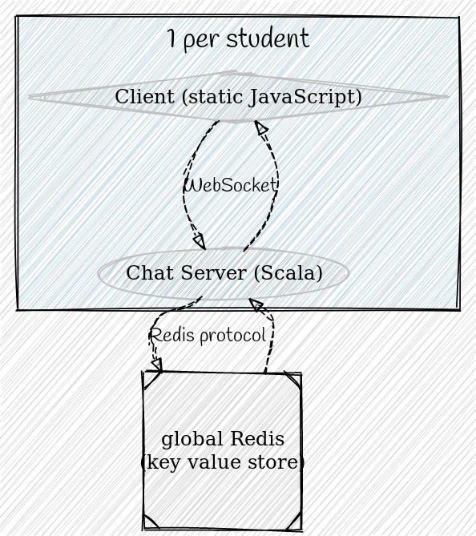

# Part 3

## Putting it All Together

----

## Chat server plugins

You will write your own plugins for a chat server. There are 2 kinds of plugins:

* Personal
  * Plugins from **your perspective** (only _you_ will see these changes)
* Public
  * Plugins from **a global perspective** (everyone will will see these changes)

----

 <!-- .element height="50%" width="50%" -->

----

```scala
def public(
    transform: (UserName, IncomingWebsocketMessage) => IO[IncomingWebsocketMessage]
): PublicChatPlugin

def publicSync(
    transform: (UserName, IncomingWebsocketMessage) => IncomingWebsocketMessage
): PublicChatPlugin =

def personal(
    transform: (UserName, OutgoingWebsocketMessage) => IO[OutgoingWebsocketMessage]
): PersonalChatPlugin

def personalSync(
    transform: (UserName, OutgoingWebsocketMessage) => OutgoingWebsocketMessage
): PersonalChatPlugin
```

