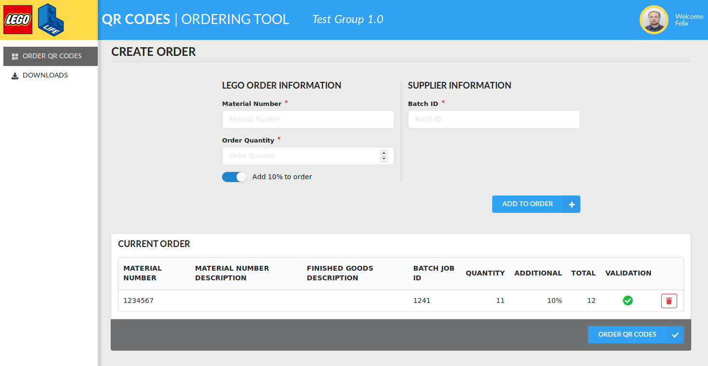
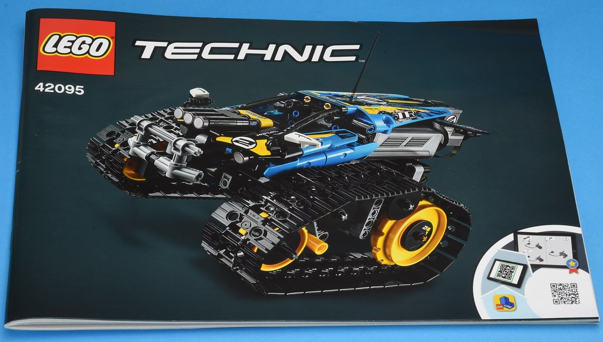
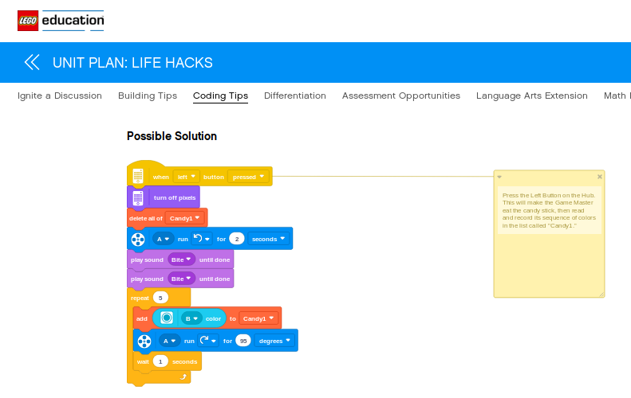
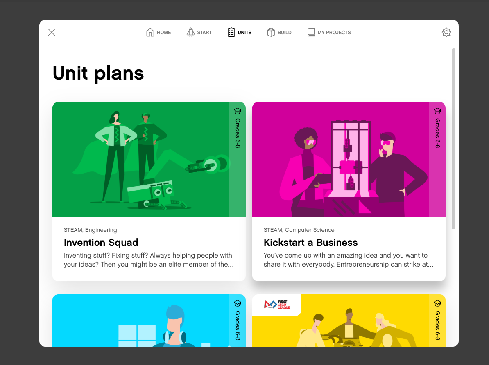
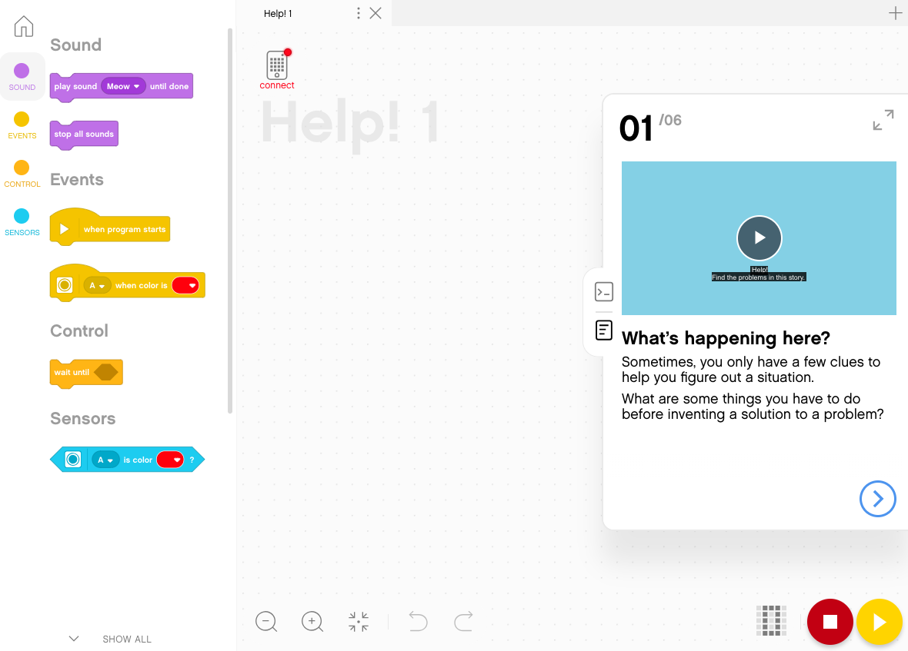

# Scala and FP at LEGO®

----

## Code Delivery Platform

 <!-- .element height="50%" width="50%" -->

> **~250 million** QR codes generated as of Nov 27, 2019

_All backends **in Scala**_

----

 <!-- .element height="50%" width="50%" -->

> Potentially impacts _all_ LEGO® products

----

## Content Delivery for the Spike Prime App

----

### Rendered code stacks

 <!-- .element height="50%" width="50%" -->

> Delivered with Scala and [http4s](https://http4s.org/) 

----

### Spike Prime App Content

<!-- .element height="50%" width="50%" -->

----

<!-- .element height="50%" width="50%" -->

----

### LEGO® Education shop 

 <!-- .element height="50%" width="50%" -->

> Shopping cart and checkout made with Scala

----

## React

> **React** uses many FP concepts and has **tremendous traction at LEGO®**