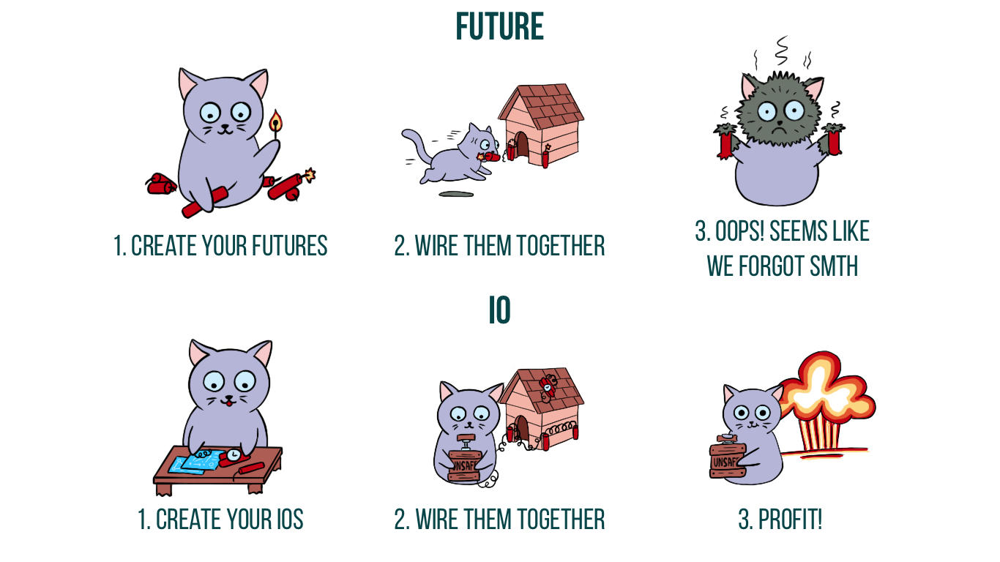

# Part 1

## Effects

----

> Functional programmers **don't like side effects**


----

* **Ordering** of **side effects** is difficult to reason about
  * Dijkstra said so ([Go To Statement Considered Harmful](https://homepages.cwi.nl/~storm/teaching/reader/Dijkstra68.pdf))  
* **Programs without side effects are useless** (and un-observable)
* We can **just pretend that *Scala* doesn't have them!** 
  * With discipline, we can get *referential transparency*

----

## Referential Transparency

----

When we program with side-effects, we lose *referential transparency:*

```scala mdoc
case class Number(var n:Int){
  def add(m:Int): Number = {
      n = n + m
      this
  }
}

val x = Number(39)

val y = x add 3

y == Number(42) // Yay

(x add 3) == Number(42) //Yikes!

```

----

Some things are *easier for our brains* if stuff doesn't change:

```scala mdoc:reset

case class Number(n:Int){
  def add(m:Int): Number = Number(n + m)
}

val x = Number(39)

val y = x add 3

y == Number(42) // Yay

(x add 3) == Number(42) //Yay 😎 !

```

----

## Referentially transparent effects


```scala mdoc:reset:invisible
import scala.concurrent.ExecutionContext.Implicits.global
import scala.concurrent.Future
import scala.concurrent.Await
import scala.concurrent.duration._
```

```scala mdoc
def app = for {
  _ <- Future { println("Yay!") }
  _ <- Future { println("Yay!") }
  _ <- Future { println("Yay!") }
} yield ()

Await.result(app,500.millis)
```

----

<span style="font-size:3em">🤔</span> lots of code duplication...**refactor**!

> **Common Subexpression Elimination:** *extract syntactically equivalent expression into constant*

----

```scala mdoc:reset:invisible
import scala.concurrent.ExecutionContext.Implicits.global
import scala.concurrent.Future
import scala.concurrent.Await
import scala.concurrent.duration._
```

```scala mdoc

def app = { 
  val printYay = Future { println("Yay!") }
  for {
    _ <- printYay
    _ <- printYay
    _ <- printYay
  } yield ()
}

Await.result(app, 500.millis)
```

<div class="fragment">
 <span style="font-size:5em">🤷</span>
</div>
----


(**CREDIT**: [Impure Pics](https://impurepics.com))

----

> *Future* is **not referentially transparent**. 

Requires you to understand about *how Scala evaluates your expressions* <span style="font-size:3em">🤯</span>

----

## Enter: **Cats**

 <!-- .element height="50%" width="50%" -->

----

[Cats](https://typelevel.org/cats/)

> Lightweight, modular, and extensible library for functional programming


----

# [Cats Effect](https://typelevel.org/cats-effect/)

> The IO Monad for Scala

Cats effect is both an "*interface*" and an *implementation* of referentially transparent effects in Scala.

----

```scala mdoc:reset
import cats.effect._
```

```scala mdoc
val app = for {
  _ <- IO.delay{ println("Yay!") }
  _ <- IO.delay{ println("Yay!") }
  _ <- IO.delay{ println("Yay!") }
} yield ()

```


<span style="font-size:3em">🤔</span> no side-effects...**at all!?**


----
```scala mdoc:reset:invisible
import cats.effect._
```
```scala mdoc
val app = for {
  _ <- IO.delay{ println("Yay!") }
  _ <- IO.delay{ println("Yay!") }
  _ <- IO.delay{ println("Yay!") }
} yield ()

app.unsafeRunSync()
```

<span style="font-size:3em">🤔</span> lots of code duplication again...<span style="font-size:3em">😨</span>**refactor**?

----

```scala mdoc:reset:invisible
import cats.effect._
```
```scala mdoc
val printYay = IO.delay{ println("Yay!")  }

val app = for {
  _ <- printYay
  _ <- printYay
  _ <- printYay
} yield ()
```

...drum-roll please <span style="font-size:3em">🥁</span>

----

```scala mdoc
app.unsafeRunSync()
```


----

# Exercise 1

Build your own effect type.

```
├── exercises
│   ├── build.sbt
│   ├── exercise1
│   │   └── src
│   │       ├── main
│   │       │   └── scala
│   │       │       └── exercise1
│   │       │           ├── Exercise1Main.scala
│   │       │           └── SpecialFx.scala
│   │       └── test
│   │           └── scala
│   │               └── exercise1
│   │                   └── SpecialFxSpec.scala
```

