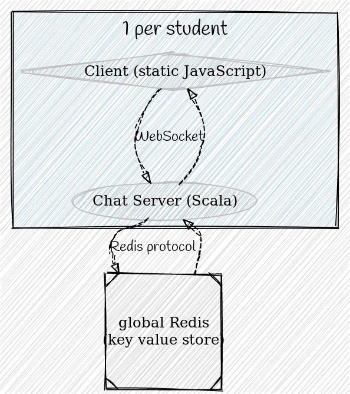

# Part 3

## Putting it All Together

----

## Chat server plugins

You will write your own plugins for a chat server. There are 2 kinds of plugins:

* Personal 
  * Plugins from **your perspective** (only _you_ will see these changes)
* Public
  * Plugins from **a global perspective** (everyone will will see these changes)

----

 <!-- .element height="50%" width="50%" -->

----

```scala
type PluginLogic[F[_]]     = 
    (UserName, IncomingWebsocketMessage) => 
        F[IncomingWebsocketMessage]

// A public chat plugin works on messages coming from the user, 
// before sending them on to the outside world.
// It can be features like processing commands, 
// that the other servers might not have implemented.
type PublicChatPlugin[F[_]] = 
    ChatPlugin[F, IncomingWebsocketMessage]

// A personal chat plugin works on messages
// coming from the outside, before being sent to the user.
// It can be stuff like highlighting your username in messages.
type PersonalChatPlugin[F[_]] = 
    ChatPlugin[F, OutgoingWebsocketMessage]
```